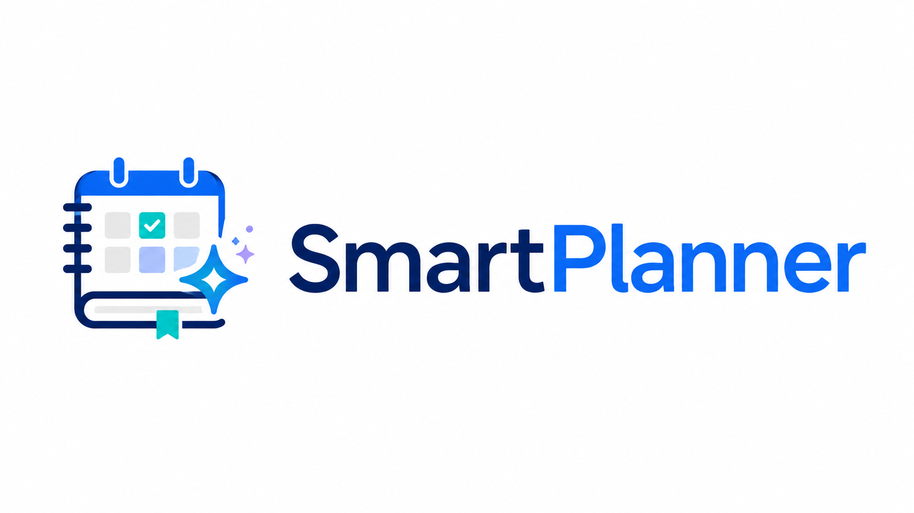
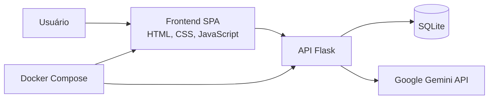

# SmartPlanner

<div align="center">
  

  <h3>Plataforma web para criação, organização e enriquecimento de planos de aula com Inteligência Artificial.</h3>

  <p>
    
    
    
    
    
    
  </p>
</div>

---

## Sobre o projeto

**SmartPlanner** é uma aplicação full stack desenvolvida para facilitar a criação e o gerenciamento de planos de aula. O sistema combina uma interface moderna e responsiva com uma API em Flask, persistência em SQLite e integração com o **Google Gemini** para gerar recomendações pedagógicas automaticamente.

O projeto foi pensado para demonstrar, em nível de portfólio, boas práticas de desenvolvimento web, organização de código, integração com API externa, experiência do usuário, containerização e observabilidade básica.

---

## Destaques

- **CRUD completo de planos de aula**: cadastro, listagem, edição, visualização e exclusão.
- **Smart Assist com IA**: geração automática de conteúdos complementares, recursos de apoio e tags.
- **Frontend SPA com Vanilla JavaScript**: navegação fluida sem recarregar a página.
- **Interface moderna e responsiva**: layout com cards, filtros, modal detalhado, estados de loading e feedback visual.
- **Tratamento visual para textos longos**: disciplinas extensas e tags não quebram o layout da listagem.
- **Busca, filtros e ordenação**: pesquisa por título, disciplina, tags, data prevista e ordenação dinâmica.
- **Impressão profissional**: geração de uma versão formatada do plano para impressão.
- **Compartilhamento**: suporte à Web Share API e fallback para copiar o conteúdo para a área de transferência.
- **Backend com logs estruturados**: registro de operações, filtros aplicados, latência e uso da IA.
- **Ambiente Dockerizado**: execução padronizada com Docker e Docker Compose.
- **Persistência de dados**: banco SQLite mantido em volume Docker ou na pasta `instance`, dependendo da configuração usada.

---

## Demonstração visual

### Tela principal

Listagem dos planos de aula com filtros, paginação e ações rápidas.


### Visualização detalhada

Modal com todos os dados do plano, incluindo conteúdos gerados ou complementados pela IA.


### Impressão do plano

Layout limpo e organizado para impressão ou arquivamento.

| Impressão - Parte 1 | Impressão - Parte 2 |
|---|---|
|  |  |

### Cadastro e edição

Formulário para criação e atualização dos planos de aula.


### Smart Assist

Processamento da IA e preenchimento automático de recomendações.

| IA processando | Campos preenchidos |
|---|---|
|  |  |

### API

Página de status e endpoint de health check.

| API online | Health check |
|---|---|
|  |  |

---

## Arquitetura



### Fluxo principal

1. O usuário cadastra ou edita um plano de aula pelo frontend.
2. O frontend envia os dados para a API Flask.
3. A API valida os campos e persiste os dados no SQLite.
4. Quando o Smart Assist é acionado, a API envia título, disciplina e ementa para o Gemini.
5. A IA retorna recomendações, conteúdos complementares e tags.
6. O frontend preenche os campos automaticamente e permite salvar o plano.

---

## Tecnologias utilizadas

### Frontend

- HTML5
- CSS3
- Bootstrap 5
- Bootstrap Icons
- Vanilla JavaScript
- Web Share API
- Clipboard API

### Backend

- Python 3.11
- Flask
- Flask-CORS
- Flask-SQLAlchemy
- SQLite
- Google GenAI SDK
- python-dotenv
- Gunicorn

### DevOps e qualidade

- Docker
- Docker Compose
- GitHub Actions
- Linter para validação de código
- Health check da API
- Logs estruturados no backend

---

## Estrutura do projeto

```text
smartplanner/
├── .github
│   └── workflows
│       └── linter.yml
├── assets/
│   ├── 01-listagem.png
│   ├── 02-visualizacao.png
│   ├── 03-impressao-parte1.png
│   ├── 04-impressao-parte2.png
│   ├── 05-formulario-vazio.png
│   ├── 06-ia-carregando.png
│   ├── 07-formulario-preenchido.png
│   ├── 08-api-online.png
│   └── 09-health-check.png
├── frontend/
│   ├── index.html
│   ├── app.js
│   ├── style.css
│   └── favicon.png
├── .env
├── .gitattributes
├── .gitignore
├── app.py
├── docker-compose.yml
├── Dockerfile
├── README.md
└── requirements.txt
```

---

## Variáveis de ambiente

Crie um arquivo `.env` na raiz do projeto:

```env
GEMINI_API_KEY=sua_chave_da_api_gemini
```

---

## Como executar com Docker

### 1. Clone o repositório

```bash
git clone https://github.com/diegobrnrd/smartplanner.git
cd smartplanner
```

### 2. Configure o `.env`

```bash
GEMINI_API_KEY=sua_chave_da_api_gemini
```

### 3. Suba os containers

Com Docker Compose v2:

```bash
docker compose up --build -d
```

Ou, se estiver usando a versão clássica:

```bash
docker-compose up --build -d
```

### 4. Acesse a aplicação

- **Frontend:** `http://localhost:8080`
- **Backend:** `http://localhost:5000`
- **Health check:** `http://localhost:5000/health`

### 5. Verifique os logs

```bash
docker logs smartplanner-api
```

### 6. Parar a aplicação

```bash
docker compose down
```

Para remover também os dados persistidos em volume:

```bash
docker compose down -v
```

> Atenção: o comando com `-v` remove o volume do banco de dados e apaga os planos cadastrados no ambiente Docker.

---

## Como executar localmente sem Docker

### 1. Crie o ambiente virtual

Windows:

```bash
python -m venv venv
venv\Scripts\activate
```

Linux/macOS:

```bash
python3 -m venv venv
source venv/bin/activate
```

### 2. Instale as dependências

```bash
pip install -r requirements.txt
```

### 3. Configure o `.env`

```env
GEMINI_API_KEY=sua_chave_da_api_gemini
```

### 4. Execute o backend

```bash
python app.py
```

### 5. Execute o frontend

Abra o arquivo `frontend/index.html` no navegador ou use uma extensão como **Live Server** no VS Code.

---

## Banco de dados

O projeto utiliza **SQLite**.

- Em execução local com Flask, o banco normalmente fica em `instance/planos_aula.db`.
- Em execução com Docker, o banco pode ser persistido em um **volume Docker** ou em um bind mount, dependendo do `docker-compose.yml` usado.

Para listar volumes Docker:

```bash
docker volume ls
```

Para inspecionar um volume específico:

```bash
docker volume inspect nome_do_volume
```

Para resetar os dados do ambiente Docker:

```bash
docker compose down -v
```

---

## Endpoints da API

| Método | Rota | Descrição |
|---|---|---|
| `GET` | `/` | Página de status da API |
| `GET` | `/health` | Verifica se a API está online |
| `GET` | `/planos` | Lista planos com filtros, paginação e ordenação |
| `GET` | `/planos/<id>` | Retorna um plano específico |
| `POST` | `/planos` | Cria um novo plano de aula |
| `PUT` | `/planos/<id>` | Atualiza um plano existente |
| `DELETE` | `/planos/<id>` | Remove um plano |
| `POST` | `/smart-assist` | Gera recomendações pedagógicas com IA |

### Exemplo de criação de plano

```bash
curl -X POST http://localhost:5000/planos \
  -H "Content-Type: application/json" \
  -d '{
    "titulo": "Introdução a APIs REST",
    "objetivo": "Compreender os fundamentos de APIs REST e seus principais métodos HTTP.",
    "ementa": "Conceitos de API, arquitetura REST, endpoints, recursos e status HTTP.",
    "data_prevista": "2026-06-09",
    "disciplina": "Desenvolvimento Web",
    "conteudos": "HTTP, JSON, REST, boas práticas de endpoints.",
    "recursos_apoio": "Documentação, exemplos práticos e exercícios guiados.",
    "tags": "API, REST, HTTP"
  }'
```

### Exemplo de uso do Smart Assist

```bash
curl -X POST http://localhost:5000/smart-assist \
  -H "Content-Type: application/json" \
  -d '{
    "titulo": "Introdução a Banco de Dados",
    "disciplina": "Banco de Dados",
    "ementa": "Conceitos iniciais de modelagem, tabelas, chaves e relacionamentos."
  }'
```

Resposta esperada:

```json
{
  "conteudos_complementares": "Sugestões de conteúdos para aprofundamento...",
  "topicos_relacionados": "Tópicos e recursos de apoio relacionados...",
  "tags_recomendadas": "Modelagem, SQL, Banco de Dados"
}
```

---

## Qualidade e observabilidade

O backend registra eventos importantes da aplicação, como:

- criação, edição e exclusão de planos;
- filtros aplicados na listagem;
- quantidade de registros retornados;
- chamadas para a IA;
- latência da geração de recomendações;
- erros de comunicação com serviços externos.

Esses logs ajudam a demonstrar preocupação com manutenção, depuração e acompanhamento do comportamento da aplicação.

---

## Melhorias futuras

- Autenticação de usuários.
- Migração para PostgreSQL em produção.
- Testes automatizados para backend e frontend.
- Deploy em ambiente cloud.
- Histórico de versões dos planos de aula.
- Dashboard com estatísticas por disciplina, tags e período.
- Geração de plano completo em formato padronizado usando IA.

---

## Autor

Desenvolvido por **Diego Bernardo**.

- GitHub: [@diegobrnrd](https://github.com/diegobrnrd)

---

## Licença

Este projeto está disponível para fins de estudo, portfólio e evolução profissional.
