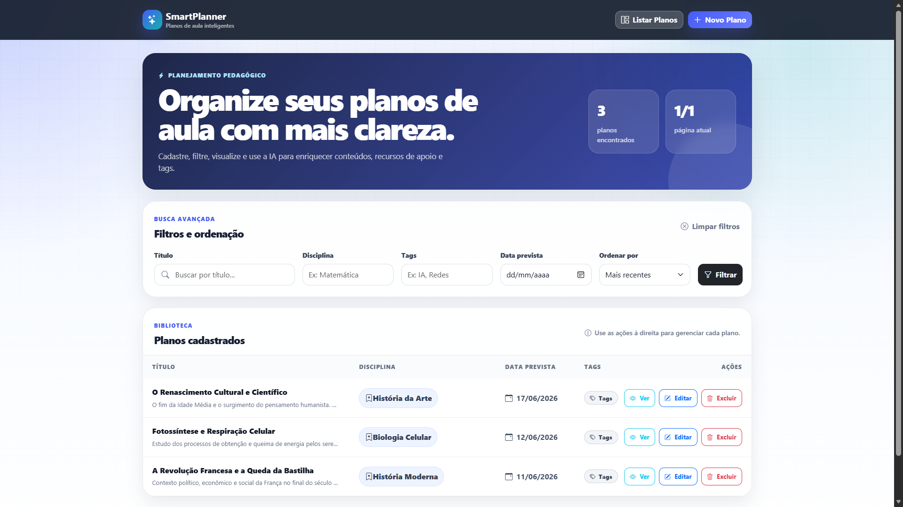
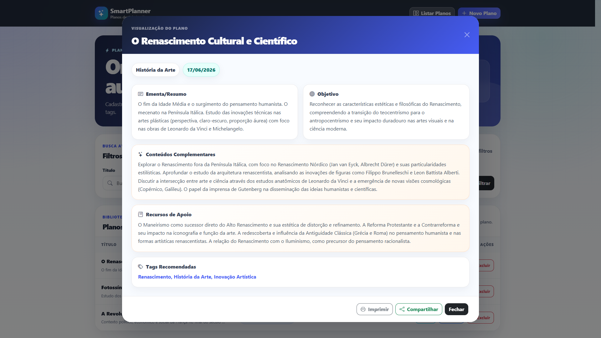
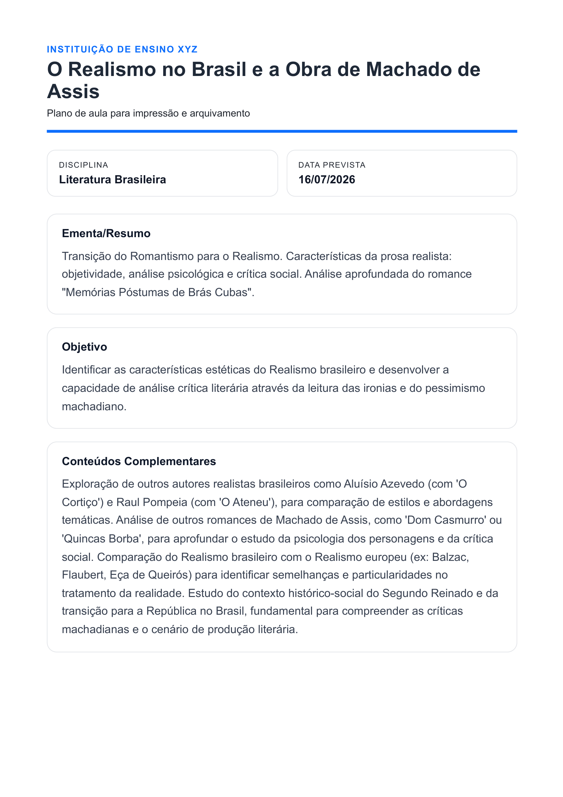
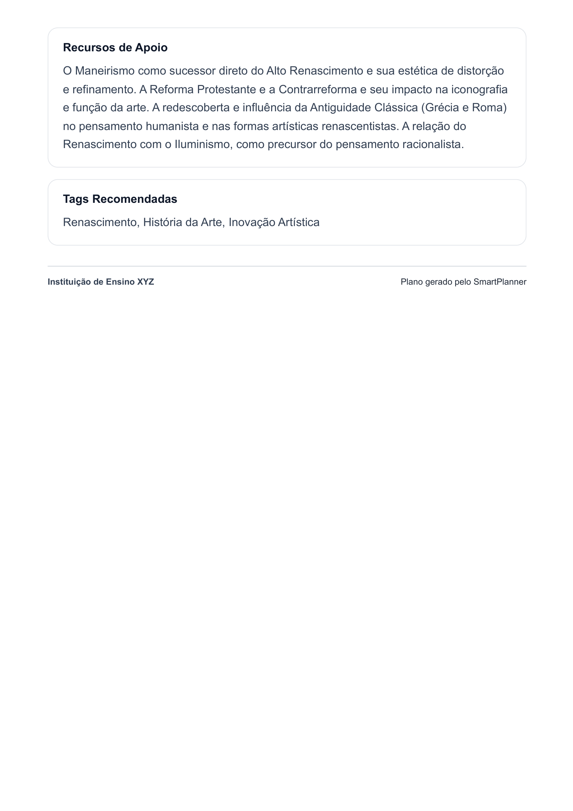
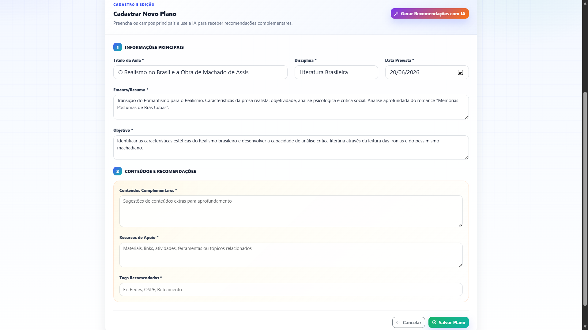
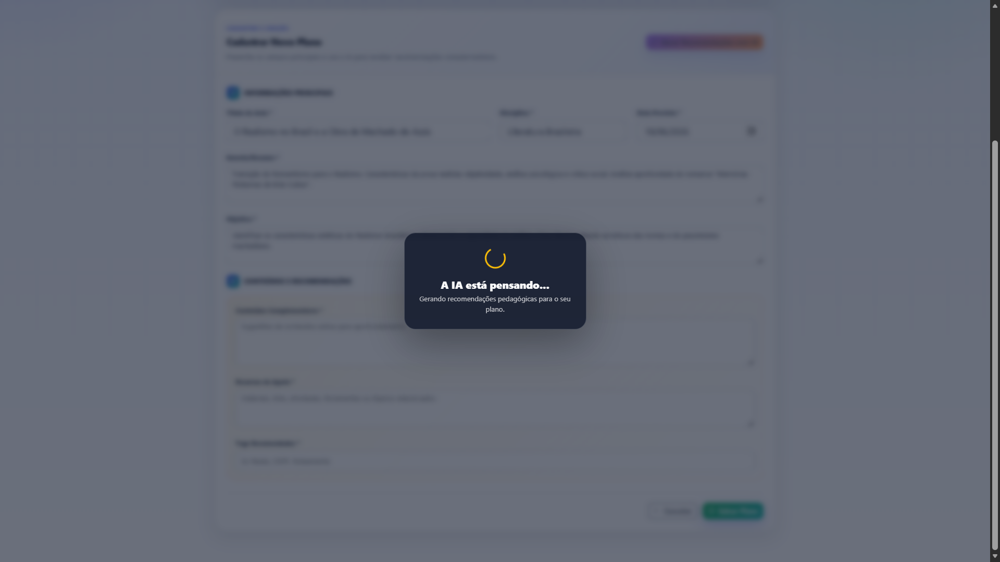
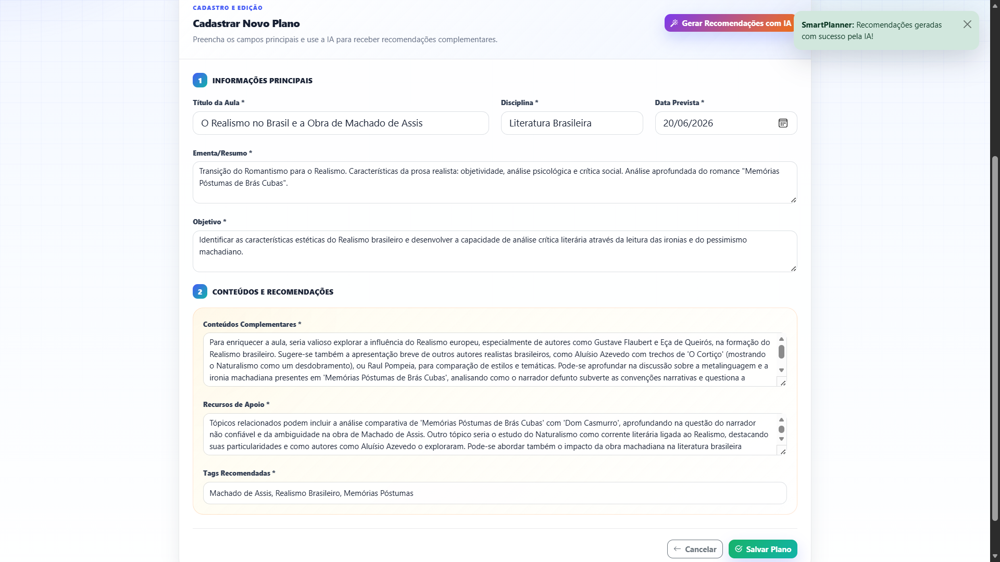
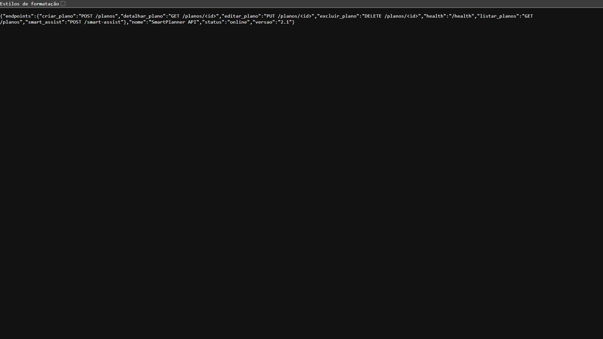
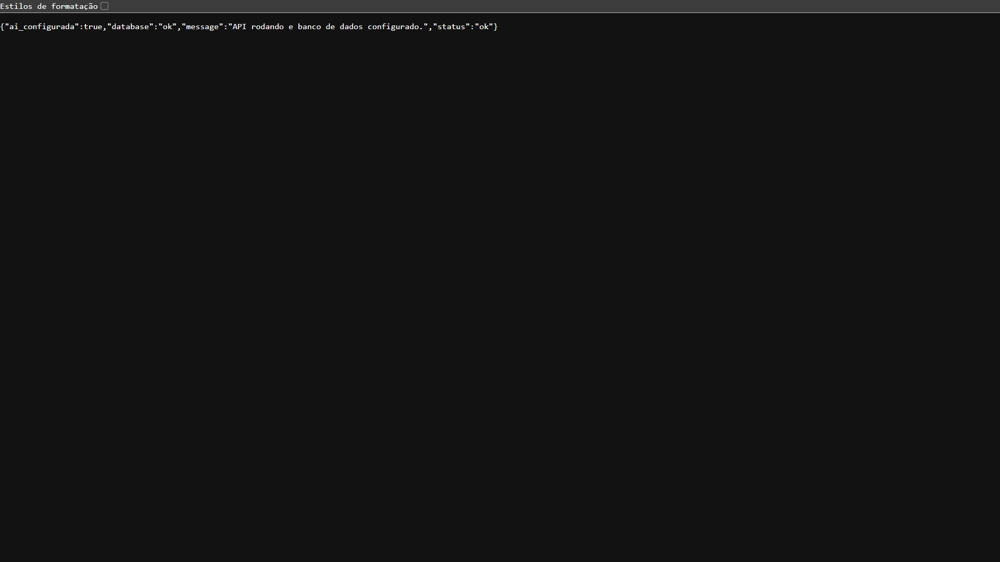

# SmartPlanner - API de Planos de Aula com IA

Esta é uma aplicação completa para o gerenciamento de planos de aula, contando com a integração de Inteligência Artificial para gerar recomendações dinâmicas de conteúdo pedagógico e foco total em Experiência do Usuário (UX) e Developer Experience (DX).

## 🚀 Tecnologias Utilizadas

* **Backend:** Python 3.11, Flask, SQLAlchemy, SQLite
* **Frontend:** HTML5, CSS3 (Bootstrap 5), Vanilla JavaScript
* **Inteligência Artificial:** Google Gemini (modelo `gemini-2.5-flash`)
* **DevOps e Observabilidade:** Docker, Docker Compose, GitHub Actions (CI para linting com Flake8), Logging estruturado

## ⚙️ Funcionalidades e Diferenciais

* **CRUD Completo:** Listagem, cadastro, edição e exclusão de planos de aula.
* **Smart Assist (Integração com IA):** Geração automática de conteúdos complementares e tags relevantes baseadas no título, ementa e disciplina da aula.
* **Interface SPA (Single Page Application):** Navegação fluida sem recarregamento da página, com feedback visual de carregamento (loading state).
* **Experiência do Usuário (UX) Avançada:**
  * Modal de visualização detalhada em modo somente leitura.
  * Geração de layout otimizado nativamente para impressão de relatórios de aula.
  * Integração com Web Share API e área de transferência (Clipboard) para compartilhamento nativo.
* **Filtros e Paginação:** Busca avançada por título, disciplina, tags e data, com ordenação dinâmica.
* **Observabilidade:** Logs estruturados no backend monitorando o tempo de resposta (latência) e uso de tokens da API de Inteligência Artificial, além das operações de banco de dados.
* **Integração Contínua (CI):** Pipeline configurado no GitHub Actions garantindo a qualidade do código a cada *push*.
* **Developer Experience (DX):** Landing page amigável na raiz da API e endpoint de verificação de saúde (`/health`).

## 📸 Galeria de Screenshots

### 1️⃣ Tela Principal - Listagem e Filtros
Visualize, edite e gerencie seus planos de aula com filtros avançados por título, disciplina, tags e data.



### 2️⃣ Visualização Detalhada
Modal interativo mostrando todos os detalhes do plano, incluindo conteúdos complementares e recomendações geradas pela IA.



### 3️⃣ Geração de PDF para Impressão
Documento formatado profissionalmente pronto para impressão e arquivamento.

<div style="display: grid; grid-template-columns: 1fr 1fr; gap: 20px;">
  <div>
    
  </div>
  <div>
    
  </div>
</div>

### 4️⃣ Formulário de Cadastro
Tela limpa e intuitiva para criar novos planos de aula com campos para título, disciplina, ementa, objetivo e mais.



### 5️⃣ Smart Assist em Ação
O botão "✨ Gerar Recomendações com IA" ativa um estado de carregamento elegante enquanto a IA processa o conteúdo.



### 6️⃣ Conteúdos Auto-Preenchidos
Após processar, a IA preenche automaticamente os campos de conteúdos complementares, recursos de apoio e tags recomendadas.



### 7️⃣ Landing Page da API
Interface amigável que confirma que o servidor backend está rodando e pronto para receber requisições.



### 8️⃣ Health Check - Monitoramento
Endpoint de verificação de saúde da API que retorna o status em tempo real, essencial para monitoramento e observabilidade.



## 🐳 Como executar com Docker (Recomendado)

A aplicação está totalmente containerizada para facilitar a avaliação e garantir a padronização do ambiente.

1. Clone este repositório para a sua máquina local.
2. Na raiz do projeto, crie um arquivo chamado `.env` e adicione a sua chave de API do Gemini:
   ```env
   GEMINI_API_KEY=sua_chave_aqui
   ```
3. Execute o comando no terminal para construir e subir os containers:
   ```bash
   docker-compose up --build -d
   ```
4. **Acessando o Sistema:**
   * **Frontend (Interface Visual):** Acesse `http://localhost:8080` no seu navegador.
   * **Backend (API):** Acesse `http://localhost:5000` para ver a página de status do servidor ou `http://localhost:5000/health` para o endpoint de monitoramento.

## 💻 Como executar localmente (Sem Docker)

Caso prefira rodar a aplicação diretamente na sua máquina:

1. Crie e ative um ambiente virtual:
   * Windows: `python -m venv venv` e depois `venv\Scripts\activate`
   * Linux/Mac: `python3 -m venv venv` e depois `source venv/bin/activate`
2. Instale as dependências listadas:
   ```bash
   pip install -r requirements.txt
   ```
3. Configure o arquivo `.env` com a sua chave `GEMINI_API_KEY`.
4. Inicie o servidor Flask:
   ```bash
   python app.py
   ```
5. Para acessar a interface, abra o arquivo `index.html` (localizado dentro da pasta `frontend`) diretamente no seu navegador.
